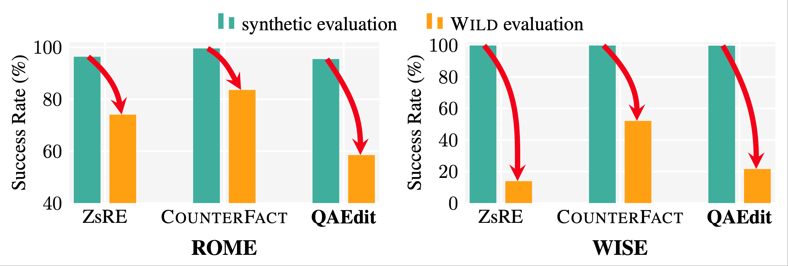
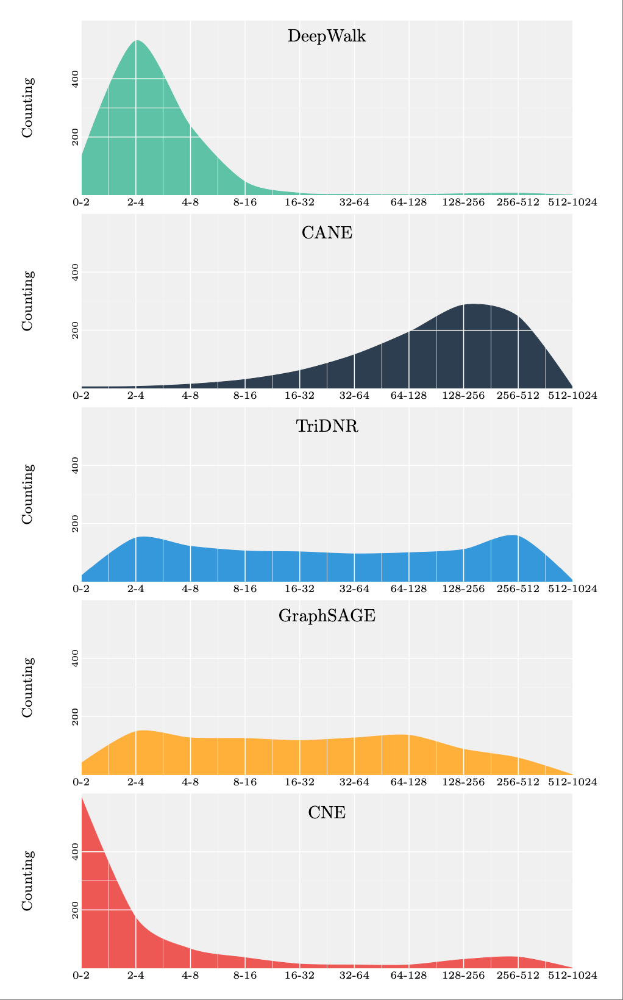

# LaTeX-Drawing

## drawing with tikz

- evaluation framework in  ACL 2025 paper [the mirage of model editing](https://arxiv.org/abs/2502.11177), **TikZ Code**: [editing_eval.tex](Drawing/editing_eval.tex)

- BERT4Rec for [CIKM 2019 paper](https://arxiv.org/abs/1904.06690) , **TikZ Code**: [self-attention.tex](Drawing/self-attention.tex)

- Pointer Network Architecture, **TikZ Code**: [pointer.tex](Drawing/pointer.tex)

- earlier version of figuer 3 in [AAI 2023](https://ojs.aaai.org/index.php/AAAI/article/view/29600/31012), **TikZ Code**: [slice.tex](Drawing/slice.tex)

- Contrastive Learning in recommendation [ICDE 2022](https://ieeexplore.ieee.org/abstract/document/98356219), **TikZ Code**: [contrastive.tex](Drawing/contrastive.tex)

- Unlearning in recommendation [WWW 2022](https://dl.acm.org/doi/abs/10.1145/3485447.3511997), **TikZ Code**: [unlearning.tex](Drawing/unlearning.tex)

## ploting with pgfplots

- bar plot with comparison in ACL 25 [the mirage of model editing](https://arxiv.org/abs/2502.11177), **TikZ Code**: [bar_with_comp.tex](Plotting/bar_with_comp.tex)

- distribution plot in RecSys 19, **TikZ Code**: [distribution.tex](Plotting/distribution.tex)

**Disclaimer**: This repository simply collects some of the TikZ code snippets I used while writing research papers. They are shared as-is, without cleanup, optimization, or any maintenance guarantee. I’m just too lazy to organize them properly 😅 — but feel free to reuse or adapt them if they help!
