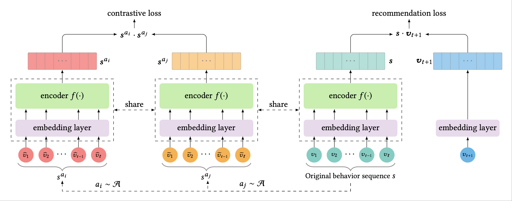

# LaTeX-Drawing

## drawing with tikz

- evaluation framework in  ACL 2025 paper [the mirage of model editing](https://arxiv.org/abs/2502.11177)

  - **TikZ Code**: [editing_eval.tex](Drawing/editing_eval.tex)

- BERT4Rec for [CIKM 2019 paper](https://arxiv.org/abs/1904.06690)

  - **TikZ Code**: [self-attention.tex](Drawing/self-attention.tex)

- Pointer Network Architecture

  - **TikZ Code**: [pointer.tex](Drawing/pointer.tex)

- earlier version of figuer 3 in [AAI 2023](https://ojs.aaai.org/index.php/AAAI/article/view/29600/31012)

  - **TikZ Code**: [slice.tex](Drawing/slice.tex)

- Contrastive Learning in recommendation [ICDE 2022](https://ieeexplore.ieee.org/abstract/document/98356219)

  - **TikZ Code**: [contrastive.tex](Drawing/contrastive.tex)

- Unlearning in recommendation [WWW 2022](https://dl.acm.org/doi/abs/10.1145/3485447.3511997)

  - **TikZ Code**: [unlearning.tex](Drawing/unlearning.tex)

## ploting with pgfplots